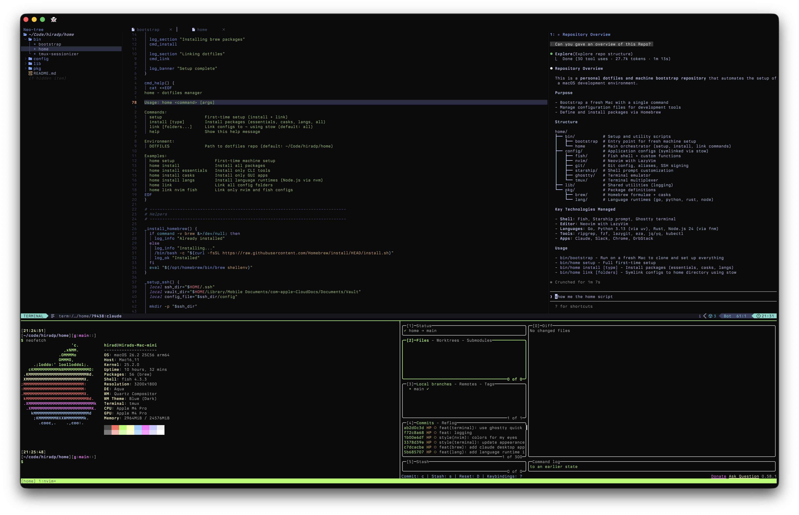

# 🏡 Home

Home is where this repo is cloned & installed.

<p align="center">
  <picture>
    <source media="(prefers-color-scheme: dark)" srcset="assets/dark.png">
    <source media="(prefers-color-scheme: light)" srcset="assets/light.png">
    
  </picture>
</p>

## Quick Start

```bash
curl -fsSL https://raw.githubusercontent.com/hiradp/home/main/bin/bootstrap | bash
```

## Usage

```
home - dotfiles manager

Usage: home <command> [args]

Commands:
  setup                 First-time setup (install + link)
  install [type]        Install packages (essentials, casks, langs, all)
  link [folders...]     Link configs to ~ using stow (default: all)
  help                  Show this help message
```
